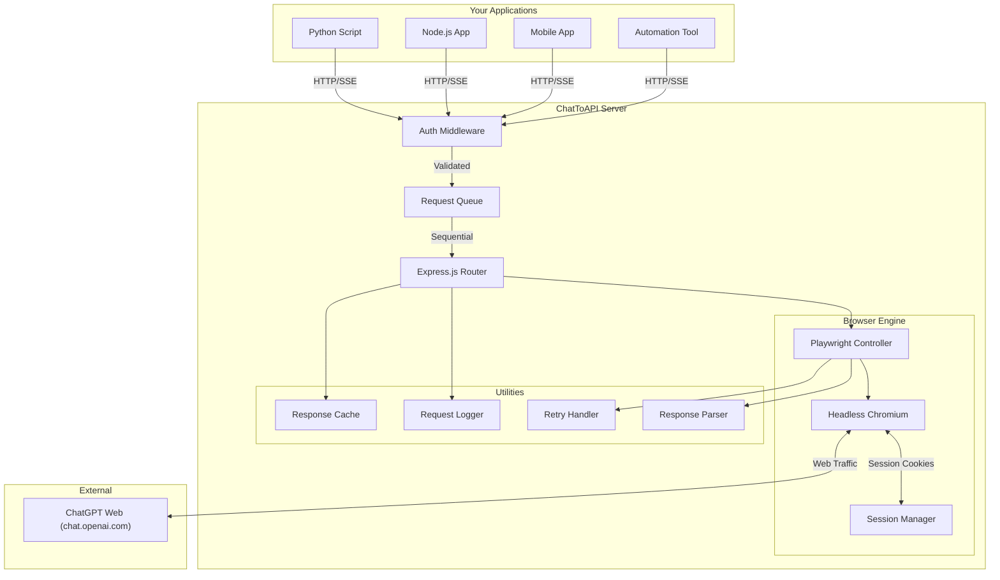
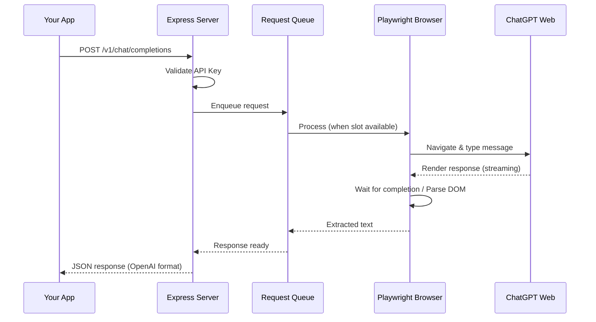
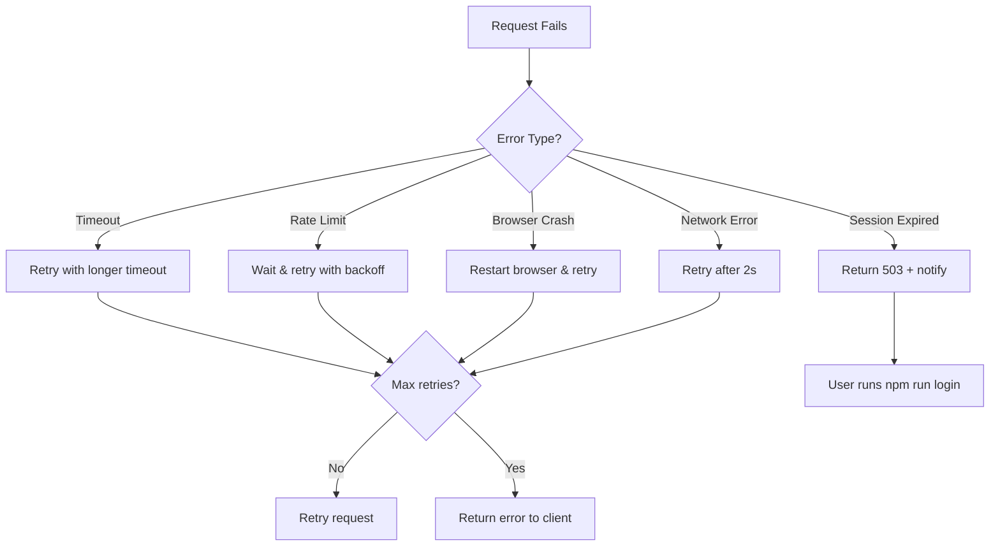

# ChatToAPI — v1 Documentation

> Turn your ChatGPT web account into a fully functional REST API.

---

## Table of Contents

1. [Overview](#overview)
2. [Architecture](#architecture)
3. [Prerequisites](#prerequisites)
4. [Project Structure](#project-structure)
5. [Step-by-Step Implementation Guide](#step-by-step-implementation-guide)
6. [API Reference](#api-reference)
7. [Configuration](#configuration)
8. [Error Handling & Recovery](#error-handling--recovery)
9. [Security](#security)
10. [Troubleshooting](#troubleshooting)
11. [Limitations](#limitations)

---

## Overview

### What is ChatToAPI?

ChatToAPI is a self-hosted bridge that converts your existing ChatGPT web subscription into a local REST API. Instead of paying separately for the OpenAI API, you can leverage your existing ChatGPT Plus/Pro/Team account programmatically.

### How Does It Work?

```
┌─────────────┐     HTTP      ┌──────────────┐    Playwright    ┌──────────────┐
│  Your App    │ ────────────► │  Express API  │ ──────────────► │  ChatGPT Web │
│  (any lang)  │ ◄──────────── │  Server       │ ◄────────────── │  Interface   │
└─────────────┘    JSON       └──────────────┘    DOM Scraping   └──────────────┘
```

1. **Playwright** launches a headless Chromium browser with your saved ChatGPT session
2. **Express.js** server accepts API requests and translates them to browser actions
3. Your app gets back **OpenAI-compatible JSON** — so any existing OpenAI SDK works out of the box

### v1 Features

| Feature | Description |
|---------|-------------|
| ✅ Send messages & receive responses | Core chat functionality |
| ✅ Streaming responses (SSE) | Real-time token-by-token output |
| ✅ Request queue | Prevents browser crashes from concurrent requests |
| ✅ Auto-retry & error recovery | Handles Cloudflare, rate limits, and transient errors |
| ✅ OpenAI SDK compatibility | Works with `openai` Python/Node.js SDK |
| ✅ Session persistence | Login once, reuse session until it expires |
| ✅ API key authentication | Protect your wrapper with your own API key |
| ✅ Docker support | One-command deployment |
| ✅ New conversation management | Start and manage chat threads |

---

## Architecture

### System Architecture Diagram



### Component Responsibilities

| Component | Role |
|-----------|------|
| **Auth Middleware** | Validates API key from `Authorization` header |
| **Request Queue** | Ensures only one request hits ChatGPT at a time (browser can't handle parallel chats) |
| **Playwright Controller** | Drives the headless browser — types messages, clicks buttons, waits for responses |
| **Session Manager** | Saves/loads browser cookies and local storage to persist login |
| **Response Parser** | Extracts the assistant's reply from the ChatGPT DOM |
| **Retry Handler** | Detects errors (Cloudflare, network, ChatGPT errors) and retries with backoff |
| **Response Cache** | Caches identical requests to avoid re-asking ChatGPT |
| **Request Logger** | Logs all API requests and responses for debugging |

### Request Lifecycle



---

## Prerequisites

### System Requirements

| Requirement | Minimum | Recommended |
|-------------|---------|-------------|
| **OS** | macOS, Linux, Windows | macOS or Linux |
| **Node.js** | v18+ | v20+ LTS |
| **RAM** | 2 GB free | 4 GB free |
| **Disk** | 500 MB | 1 GB |
| **Network** | Stable internet | Low-latency connection |

### Required Accounts

- ✅ **ChatGPT account** — Free, Plus, Pro, or Team (any plan works)
- ✅ **No OpenAI API key needed** — the whole point is we use the web interface

### Required Software

```bash
# Node.js (v18+)
# Install via nvm (recommended)
curl -o- https://raw.githubusercontent.com/nvm-sh/nvm/v0.39.0/install.sh | bash
nvm install 20
nvm use 20

# Verify installation
node --version   # Should show v20.x.x
npm --version    # Should show 10.x.x
```

---

## Project Structure

```
chattoapi/
├── .env                     # Environment variables (secrets)
├── .env.example             # Example env file (committed to git)
├── .gitignore               # Git ignore rules
├── .dockerignore            # Docker ignore rules
├── Dockerfile               # Docker container definition
├── docker-compose.yml       # Docker Compose config
├── package.json             # Node.js dependencies & scripts
├── README.md                # Quick start guide
│
├── auth/                    # Session data (gitignored)
│   └── (browser profile)    # Playwright persistent context
│
├── src/
│   ├── index.js             # Main entry point
│   ├── server.js            # Express.js API server setup
│   ├── middleware.js         # Auth, logging, error handling middleware
│   ├── router.js            # API route definitions
│   │
│   ├── browser/
│   │   ├── launcher.js      # Playwright browser lifecycle (launch, close)
│   │   ├── session.js       # Session management (login detection, cookie persistence)
│   │   ├── chat.js          # Core chat automation (send message, read response)
│   │   └── selectors.js     # CSS selectors for ChatGPT DOM elements
│   │
│   ├── queue/
│   │   └── requestQueue.js  # Sequential request queue with concurrency control
│   │
│   ├── utils/
│   │   ├── parser.js        # Response text extraction & cleanup
│   │   ├── retry.js         # Retry logic with exponential backoff
│   │   ├── cache.js         # In-memory response cache with TTL
│   │   ├── logger.js        # Structured JSON logging
│   │   └── helpers.js       # UUID generation, timestamp utils, etc.
│   │
│   └── login.js             # Standalone login script (opens visible browser)
│
├── logs/                    # Request/response logs (gitignored)
│
└── docs/
    ├── v1-documentation.md  # This file
    └── v2-documentation.md  # v2 features & roadmap
```

---

## Step-by-Step Implementation Guide

### Step 1: Initialize the Project

```bash
# Create project directory (if not exists)
mkdir -p chattoapi && cd chattoapi

# Initialize Node.js project
npm init -y

# Install dependencies
npm install express cors dotenv uuid playwright

# Install Playwright browsers (downloads Chromium)
npx playwright install chromium

# Install dev dependencies
npm install -D nodemon
```

**Update `package.json` scripts:**

```json
{
  "name": "chattoapi",
  "version": "1.0.0",
  "description": "Turn your ChatGPT account into a REST API",
  "main": "src/index.js",
  "type": "module",
  "scripts": {
    "start": "node src/index.js",
    "dev": "nodemon src/index.js",
    "login": "node src/login.js"
  }
}
```

### Step 2: Create Environment Configuration

**`.env.example`:**

```env
# Server Configuration
PORT=3000
HOST=0.0.0.0

# API Authentication
# Generate a strong key: node -e "console.log(require('crypto').randomBytes(32).toString('hex'))"
API_KEY=your-secret-api-key-here

# Browser Configuration
HEADLESS=true
BROWSER_TIMEOUT=60000

# ChatGPT Configuration
CHATGPT_URL=https://chatgpt.com

# Cache Configuration
CACHE_ENABLED=false
CACHE_TTL_SECONDS=3600

# Retry Configuration
MAX_RETRIES=3
RETRY_DELAY_MS=2000

# Logging
LOG_LEVEL=info
LOG_REQUESTS=true
```

### Step 3: Implement Browser Launcher (`src/browser/launcher.js`)

This is the foundation — launches a Chromium browser with persistent storage so your login session survives restarts.

**Key implementation details:**

```javascript
// Core concept:
// - Use Playwright's "persistent context" to save cookies/localStorage
// - The auth/ directory stores the browser profile (like a real Chrome profile)
// - On first run: browser opens visibly for manual login
// - On subsequent runs: browser opens headlessly with saved session

import { chromium } from 'playwright';
import path from 'path';

const AUTH_DIR = path.resolve('auth');

// Launch with persistent context
const context = await chromium.launchPersistentContext(AUTH_DIR, {
    headless: process.env.HEADLESS === 'true',
    viewport: { width: 1280, height: 720 },
    userAgent: 'Mozilla/5.0 (Macintosh; Intel Mac OS X 10_15_7) ...',
    args: [
        '--no-sandbox',
        '--disable-blink-features=AutomationControlled'  // Avoid bot detection
    ]
});
```

**Why persistent context?**
- Normal Playwright contexts are temporary — cookies disappear when you close the browser
- Persistent context saves everything to disk, just like a real Chrome profile
- Your ChatGPT login persists across restarts

### Step 4: Implement Session Manager (`src/browser/session.js`)

Handles detecting whether you're logged in, and triggering re-login when needed.

**Key implementation details:**

```javascript
// How to detect if logged in:
// 1. Navigate to chatgpt.com
// 2. Wait for page to load
// 3. Check if the chat input textarea exists (means we're logged in)
// 4. If redirected to login page, session has expired

async function isLoggedIn(page) {
    try {
        await page.goto('https://chatgpt.com', { waitUntil: 'networkidle' });
        // If we can find the message input, we're logged in
        const input = await page.waitForSelector('textarea, [contenteditable="true"]', {
            timeout: 10000
        });
        return !!input;
    } catch {
        return false;
    }
}
```

### Step 5: Implement Chat Automation (`src/browser/chat.js`)

The core logic — sends messages and extracts responses.

**Key implementation details:**

```javascript
// Sending a message:
// 1. Find the textarea/input element
// 2. Type the message
// 3. Press Enter or click the send button
// 4. Wait for the response to appear and finish streaming
// 5. Extract the last assistant message from the DOM

async function sendMessage(page, message) {
    // 1. Type message into the input
    const input = await page.waitForSelector('textarea');
    await input.fill(message);

    // 2. Click send button
    const sendButton = await page.waitForSelector('[data-testid="send-button"]');
    await sendButton.click();

    // 3. Wait for response to finish streaming
    // ChatGPT shows a "stop generating" button while streaming
    // Wait for it to appear (response started) then disappear (response done)
    await page.waitForSelector('[data-testid="stop-button"]', { timeout: 30000 });
    await page.waitForSelector('[data-testid="stop-button"]', {
        state: 'hidden',
        timeout: 120000
    });

    // 4. Extract the last response
    const messages = await page.$$('[data-message-author-role="assistant"]');
    const lastMessage = messages[messages.length - 1];
    const text = await lastMessage.innerText();

    return text;
}
```

> [!IMPORTANT]
> **CSS selectors change frequently.** ChatGPT updates their UI regularly. All selectors are centralized in `src/browser/selectors.js` so you only need to update one file when the UI changes.

### Step 6: Implement CSS Selectors (`src/browser/selectors.js`)

Centralized DOM selectors — the single source of truth for all ChatGPT UI elements.

```javascript
// These selectors target the ChatGPT web interface elements
// UPDATE THESE if ChatGPT changes their UI

export const SELECTORS = {
    // Input area
    messageInput: 'textarea, #prompt-textarea, [contenteditable="true"]',
    sendButton: '[data-testid="send-button"], button[aria-label="Send"]',

    // Response detection
    stopButton: '[data-testid="stop-button"]',
    assistantMessage: '[data-message-author-role="assistant"]',

    // Navigation
    newChatButton: '[data-testid="create-new-chat-button"], a[href="/"]',
    chatList: 'nav ol',

    // Login detection
    loginForm: '[action*="auth"], [data-testid="login-button"]',

    // Error detection
    errorMessage: '.error-message, [class*="error"]',
    rateLimitMessage: 'text=rate limit',
    networkError: 'text=Something went wrong',
};
```

### Step 7: Implement Request Queue (`src/queue/requestQueue.js`)

Ensures only one request hits ChatGPT at a time — the browser can't handle parallel conversations.

**Key implementation details:**

```javascript
// Why a queue?
// - The browser has ONE page with ONE chat input
// - If two requests arrive simultaneously, they'd overwrite each other
// - The queue processes requests sequentially, first-in-first-out
// - Each request gets a Promise that resolves when it's their turn

class RequestQueue {
    constructor() {
        this.queue = [];
        this.processing = false;
    }

    async enqueue(task) {
        return new Promise((resolve, reject) => {
            this.queue.push({ task, resolve, reject });
            this.processNext();
        });
    }

    async processNext() {
        if (this.processing || this.queue.length === 0) return;
        this.processing = true;

        const { task, resolve, reject } = this.queue.shift();
        try {
            const result = await task();
            resolve(result);
        } catch (error) {
            reject(error);
        } finally {
            this.processing = false;
            this.processNext();  // Process next in queue
        }
    }
}
```

### Step 8: Implement Retry Handler (`src/utils/retry.js`)

Automatically retries failed requests with exponential backoff.

```javascript
// Retry strategy:
// - Attempt 1: immediate
// - Attempt 2: wait 2 seconds
// - Attempt 3: wait 4 seconds
// - Attempt 4: wait 8 seconds (if MAX_RETRIES=4)
//
// Retryable errors:
// - Network timeouts
// - Cloudflare challenges
// - ChatGPT "Something went wrong" messages
// - Page navigation failures

async function withRetry(fn, maxRetries = 3, baseDelay = 2000) {
    for (let attempt = 1; attempt <= maxRetries; attempt++) {
        try {
            return await fn();
        } catch (error) {
            if (attempt === maxRetries) throw error;

            const delay = baseDelay * Math.pow(2, attempt - 1);
            console.log(`Attempt ${attempt} failed, retrying in ${delay}ms...`);
            await sleep(delay);

            // If it's a page crash, reload the page
            if (isPageCrash(error)) {
                await reloadChatGPT();
            }
        }
    }
}
```

### Step 9: Implement Response Cache (`src/utils/cache.js`)

Caches identical requests to avoid re-asking ChatGPT the same question.

```javascript
// Simple in-memory cache with TTL (time-to-live)
// - Key: hash of the message content
// - Value: ChatGPT's response
// - TTL: configurable, default 1 hour
//
// Use cases:
// - Same question asked multiple times (e.g., health checks)
// - Repeated API calls from retrying clients
// - Development/testing scenarios

class ResponseCache {
    constructor(ttlSeconds = 3600) {
        this.cache = new Map();
        this.ttl = ttlSeconds * 1000;
    }

    get(key) {
        const entry = this.cache.get(key);
        if (!entry) return null;
        if (Date.now() - entry.timestamp > this.ttl) {
            this.cache.delete(key);
            return null;
        }
        return entry.value;
    }

    set(key, value) {
        this.cache.set(key, { value, timestamp: Date.now() });
    }
}
```

### Step 10: Implement API Server (`src/server.js` + `src/router.js`)

Express.js server with OpenAI-compatible endpoints.

**Key routes:**

```javascript
// POST /v1/chat/completions — Main chat endpoint
// Accepts OpenAI-format request body:
// {
//   "model": "chatgpt-web",   (ignored, uses whatever model your account has)
//   "messages": [
//     { "role": "user", "content": "Hello!" }
//   ],
//   "stream": false           (true for SSE streaming)
// }

// POST /v1/chat/new — Start a new conversation
// Returns: { "status": "ok", "message": "New conversation started" }

// GET /v1/status — Health check
// Returns: { "status": "ready", "logged_in": true, "queue_size": 0 }

// POST /v1/login — Trigger manual login
// Opens a visible browser window for you to log in
// Returns: { "status": "login_started", "message": "Please log in..." }
```

### Step 11: Implement Streaming (SSE)

Server-Sent Events for real-time token streaming.

```javascript
// How streaming works:
// 1. Client sends request with "stream": true
// 2. Server sets response headers for SSE
// 3. We observe DOM changes in the ChatGPT page using MutationObserver
// 4. As new text appears, we send it as SSE events
// 5. When done, we send [DONE] event

// SSE Response format (matches OpenAI's format):
// data: {"id":"chatcmpl-xxx","choices":[{"delta":{"content":"Hello"},"index":0}]}
// data: {"id":"chatcmpl-xxx","choices":[{"delta":{"content":" world"},"index":0}]}
// data: [DONE]

app.post('/v1/chat/completions', async (req, res) => {
    if (req.body.stream) {
        res.setHeader('Content-Type', 'text/event-stream');
        res.setHeader('Cache-Control', 'no-cache');
        res.setHeader('Connection', 'keep-alive');

        // Use page.evaluate() to set up a MutationObserver
        // that watches for new text in the assistant's response
        // and sends each chunk via res.write()
    }
});
```

### Step 12: Implement Login Script (`src/login.js`)

Standalone script for first-time setup.

```javascript
// Usage: npm run login
//
// What it does:
// 1. Opens a VISIBLE Chromium browser window (not headless)
// 2. Navigates to chatgpt.com
// 3. You manually log in with your credentials
// 4. Script detects successful login
// 5. Saves session cookies to auth/ directory
// 6. Closes browser
//
// After this, `npm start` will use the saved session headlessly
```

### Step 13: Docker Setup

**`Dockerfile`:**

```dockerfile
FROM mcr.microsoft.com/playwright:v1.49.1-noble

WORKDIR /app
COPY package*.json ./
RUN npm ci --production
COPY . .

# Create auth directory
RUN mkdir -p auth logs

EXPOSE 3000
CMD ["node", "src/index.js"]
```

**`docker-compose.yml`:**

```yaml
version: '3.8'
services:
  chattoapi:
    build: .
    ports:
      - "${PORT:-3000}:3000"
    volumes:
      - ./auth:/app/auth          # Persist session across restarts
      - ./logs:/app/logs          # Persist logs
      - ./.env:/app/.env          # Load environment variables
    environment:
      - HEADLESS=true
    restart: unless-stopped
```

---

## API Reference

### Authentication

All endpoints require an API key in the `Authorization` header:

```
Authorization: Bearer your-api-key
```

### Endpoints

---

#### `POST /v1/chat/completions`

Send a message to ChatGPT and receive a response.

**Request:**

```json
{
    "model": "chatgpt-web",
    "messages": [
        {
            "role": "system",
            "content": "You are a helpful assistant."
        },
        {
            "role": "user",
            "content": "What is the capital of France?"
        }
    ],
    "stream": false
}
```

| Field | Type | Required | Description |
|-------|------|----------|-------------|
| `model` | string | No | Ignored in v1 (uses your account's default model) |
| `messages` | array | Yes | Array of message objects. Only the **last user message** is sent to ChatGPT |
| `stream` | boolean | No | Set `true` for SSE streaming. Default: `false` |

**Response (non-streaming):**

```json
{
    "id": "chatcmpl-a1b2c3d4",
    "object": "chat.completion",
    "created": 1711000000,
    "model": "chatgpt-web",
    "choices": [
        {
            "index": 0,
            "message": {
                "role": "assistant",
                "content": "The capital of France is Paris."
            },
            "finish_reason": "stop"
        }
    ],
    "usage": {
        "prompt_tokens": 0,
        "completion_tokens": 0,
        "total_tokens": 0
    }
}
```

> [!NOTE]
> `usage` token counts are always `0` in v1 since we're scraping the web interface, not the API. This field is included for SDK compatibility.

**Response (streaming, `stream: true`):**

```
data: {"id":"chatcmpl-a1b2c3d4","object":"chat.completion.chunk","created":1711000000,"model":"chatgpt-web","choices":[{"index":0,"delta":{"role":"assistant","content":""},"finish_reason":null}]}

data: {"id":"chatcmpl-a1b2c3d4","object":"chat.completion.chunk","created":1711000000,"model":"chatgpt-web","choices":[{"index":0,"delta":{"content":"The"},"finish_reason":null}]}

data: {"id":"chatcmpl-a1b2c3d4","object":"chat.completion.chunk","created":1711000000,"model":"chatgpt-web","choices":[{"index":0,"delta":{"content":" capital"},"finish_reason":null}]}

data: [DONE]
```

---

#### `POST /v1/chat/new`

Start a new ChatGPT conversation (clears context).

**Request:** No body needed.

**Response:**

```json
{
    "status": "ok",
    "message": "New conversation started"
}
```

---

#### `GET /v1/status`

Check system health and login status.

**Response:**

```json
{
    "status": "ready",
    "logged_in": true,
    "queue_size": 0,
    "uptime_seconds": 3600,
    "version": "1.0.0",
    "cache": {
        "enabled": true,
        "entries": 12
    }
}
```

| Field | Description |
|-------|-------------|
| `status` | `ready`, `initializing`, `login_required`, or `error` |
| `logged_in` | Whether the browser has a valid ChatGPT session |
| `queue_size` | Number of pending requests in the queue |

---

#### `POST /v1/login`

Trigger a manual login flow. Opens a visible browser window.

**Response:**

```json
{
    "status": "login_started",
    "message": "A browser window has been opened. Please log in to ChatGPT. The window will close automatically after successful login."
}
```

> [!WARNING]
> This endpoint only works when the server has access to a display (not in headless Docker). For Docker, mount the `auth/` volume and run `npm run login` on the host first.

---

### Using with OpenAI SDKs

#### Python

```python
from openai import OpenAI

client = OpenAI(
    api_key="your-chattoapi-key",      # Your wrapper's API key
    base_url="http://localhost:3000/v1"  # Point to your local server
)

response = client.chat.completions.create(
    model="chatgpt-web",
    messages=[
        {"role": "user", "content": "Explain quantum computing in simple terms"}
    ]
)

print(response.choices[0].message.content)
```

#### Python (Streaming)

```python
stream = client.chat.completions.create(
    model="chatgpt-web",
    messages=[{"role": "user", "content": "Write a poem about coding"}],
    stream=True
)

for chunk in stream:
    if chunk.choices[0].delta.content:
        print(chunk.choices[0].delta.content, end="", flush=True)
```

#### Node.js

```javascript
import OpenAI from 'openai';

const client = new OpenAI({
    apiKey: 'your-chattoapi-key',
    baseURL: 'http://localhost:3000/v1'
});

const response = await client.chat.completions.create({
    model: 'chatgpt-web',
    messages: [{ role: 'user', content: 'Hello!' }]
});

console.log(response.choices[0].message.content);
```

#### cURL

```bash
curl -X POST http://localhost:3000/v1/chat/completions \
  -H "Authorization: Bearer your-chattoapi-key" \
  -H "Content-Type: application/json" \
  -d '{
    "messages": [{"role": "user", "content": "What is 2+2?"}]
  }'
```

---

## Configuration

### Environment Variables

| Variable | Default | Description |
|----------|---------|-------------|
| `PORT` | `3000` | API server port |
| `HOST` | `0.0.0.0` | Server bind address |
| `API_KEY` | — | **Required.** API key for authenticating requests |
| `HEADLESS` | `true` | Run browser without UI. Set `false` for debugging |
| `BROWSER_TIMEOUT` | `60000` | Max time (ms) to wait for ChatGPT responses |
| `CHATGPT_URL` | `https://chatgpt.com` | ChatGPT base URL |
| `CACHE_ENABLED` | `false` | Enable response caching |
| `CACHE_TTL_SECONDS` | `3600` | Cache entry lifetime (seconds) |
| `MAX_RETRIES` | `3` | Max retry attempts for failed requests |
| `RETRY_DELAY_MS` | `2000` | Base delay between retries (doubles each attempt) |
| `LOG_LEVEL` | `info` | Logging level: `debug`, `info`, `warn`, `error` |
| `LOG_REQUESTS` | `true` | Log all API requests and responses |

---

## Error Handling & Recovery

### Error Response Format

All errors follow this format:

```json
{
    "error": {
        "message": "Human-readable error description",
        "type": "error_type",
        "code": "error_code"
    }
}
```

### Error Types

| HTTP Status | Error Code | Cause | Auto-Recovery |
|-------------|------------|-------|---------------|
| `401` | `invalid_api_key` | Missing or wrong API key | ❌ Fix your key |
| `429` | `rate_limited` | ChatGPT rate limiting you | ✅ Auto-retry with backoff |
| `500` | `browser_error` | Browser crashed or page error | ✅ Auto-restart browser |
| `502` | `chatgpt_error` | ChatGPT returned an error | ✅ Auto-retry |
| `503` | `session_expired` | Login session expired | ❌ Run `npm run login` |
| `504` | `timeout` | Response took too long | ✅ Auto-retry |

### Auto-Recovery Flow



---

## Security

### Best Practices

1. **Generate a strong API key:**
   ```bash
   node -e "console.log(require('crypto').randomBytes(32).toString('hex'))"
   ```

2. **Never expose to the public internet** — this is for local/private network use only

3. **Keep `auth/` directory private** — it contains your ChatGPT session. Add to `.gitignore`

4. **Use HTTPS** if exposing beyond localhost — put behind a reverse proxy (nginx/Caddy)

5. **Rotate your API key** periodically by updating the `.env` file

### What's Stored Locally

| Location | Contents | Sensitive? |
|----------|----------|------------|
| `auth/` | Browser cookies, localStorage, session data | ⚠️ **Yes** — contains your ChatGPT session |
| `.env` | API key, configuration | ⚠️ **Yes** — contains your API key |
| `logs/` | Request/response logs | ⚠️ May contain chat content |

---

## Troubleshooting

### Common Issues

| Problem | Cause | Solution |
|---------|-------|----------|
| "Login required" after restart | Session cookies expired | Run `npm run login` again |
| Response takes very long | ChatGPT is slow/busy | Increase `BROWSER_TIMEOUT` |
| Empty responses | CSS selectors outdated | Update `src/browser/selectors.js` |
| "Browser crashed" errors | Out of memory | Increase available RAM, reduce concurrent usage |
| Cloudflare challenge | Bot detection triggered | Restart server, use `HEADLESS=false` temporarily |
| "Queue timeout" | Previous request stuck | Restart the server |

### Debug Mode

Run with visible browser to see what's happening:

```bash
HEADLESS=false npm run dev
```

This opens a Chromium window so you can watch the automation in real-time.

### Checking Logs

```bash
# View recent logs
tail -f logs/chattoapi.log

# Search for errors
grep "error" logs/chattoapi.log
```

---

## Limitations

| Limitation | Details |
|------------|---------|
| **One request at a time** | Requests are queued — parallel requests wait in line |
| **Response speed** | Slower than the official API (~5-15s per response vs ~1-3s) |
| **No token counting** | Usage stats return 0 (no way to count tokens from web UI) |
| **Selector fragility** | ChatGPT UI changes may break selectors (centralized in one file for easy fixes) |
| **Session expiry** | You need to re-login every ~30 days |
| **Rate limits** | ChatGPT may rate-limit you faster than the official API |
| **Single model** | v1 uses whatever model your account defaults to |
| **No function calling** | The web UI doesn't expose function/tool calling in a parseable way |

---

## Quick Start Summary

```bash
# 1. Clone/setup the project
cd chattoapi
npm install
npx playwright install chromium

# 2. Configure
cp .env.example .env
# Edit .env with your API key

# 3. Login to ChatGPT (first time only)
npm run login
# → Browser opens, log in manually, wait for success message

# 4. Start the server
npm start
# → Server running on http://localhost:3000

# 5. Test it
curl http://localhost:3000/v1/status \
  -H "Authorization: Bearer your-api-key"

# 6. Send a message
curl -X POST http://localhost:3000/v1/chat/completions \
  -H "Authorization: Bearer your-api-key" \
  -H "Content-Type: application/json" \
  -d '{"messages": [{"role": "user", "content": "Hello!"}]}'
```

---

*v1 Documentation — ChatToAPI*
*Last updated: 2026-03-19*
