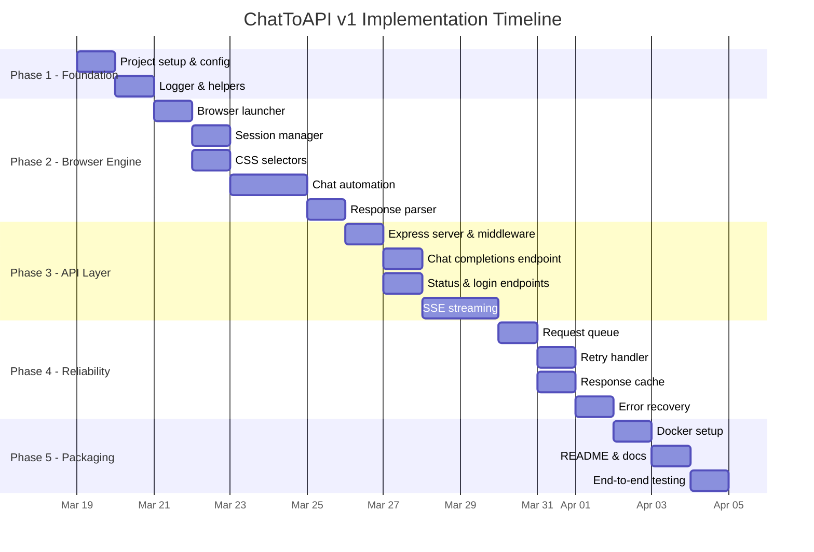

# ChatToAPI v1 — Implementation Plan

> Step-by-step plan to build the ChatGPT-to-API wrapper, organized into 5 phases.

---

## Phase Overview



---

## Phase 1: Project Foundation

**Goal:** Set up the project skeleton, install dependencies, and build shared utilities.

**Estimated time:** 1–2 days

### Tasks

#### 1.1 — Initialize Node.js Project

| Item | Detail |
|------|--------|
| **File** | `package.json` |
| **Action** | Run `npm init -y`, set `"type": "module"`, add scripts |
| **Dependencies** | `express`, `cors`, `dotenv`, `uuid`, `playwright` |
| **Dev Dependencies** | `nodemon` |

**Scripts to create:**
```json
{
  "start": "node src/index.js",
  "dev": "nodemon src/index.js",
  "login": "node src/login.js"
}
```

**Acceptance criteria:**
- [ ] `npm install` completes without errors
- [ ] `npx playwright install chromium` downloads browser
- [ ] `npm run dev` starts without crashing (even if no server code yet)

---

#### 1.2 — Create Environment Configuration

| Item | Detail |
|------|--------|
| **Files** | `.env.example`, `.env`, `.gitignore` |
| **Action** | Define all config variables with defaults |

**`.env.example` contents:**
```env
PORT=3000
HOST=0.0.0.0
API_KEY=change-me
HEADLESS=true
BROWSER_TIMEOUT=60000
CHATGPT_URL=https://chatgpt.com
CACHE_ENABLED=false
CACHE_TTL_SECONDS=3600
MAX_RETRIES=3
RETRY_DELAY_MS=2000
LOG_LEVEL=info
LOG_REQUESTS=true
```

**`.gitignore` must include:**
```
node_modules/
auth/
logs/
.env
*.log
```

**Acceptance criteria:**
- [ ] `dotenv` loads all variables correctly
- [ ] `.gitignore` prevents sensitive files from being committed
- [ ] `.env.example` documents every variable

---

#### 1.3 — Build Logger Utility

| Item | Detail |
|------|--------|
| **File** | `src/utils/logger.js` |
| **Action** | Create structured JSON logger with levels |

**Functions to implement:**
```
logger.debug(message, metadata?)
logger.info(message, metadata?)
logger.warn(message, metadata?)
logger.error(message, metadata?)
```

**Output format:**
```json
{"level":"info","message":"Server started","port":3000,"timestamp":"2026-03-19T12:00:00Z"}
```

**Acceptance criteria:**
- [ ] Logs to console with proper formatting
- [ ] Respects `LOG_LEVEL` from `.env`
- [ ] Includes timestamp in every log entry

---

#### 1.4 — Build Helper Utilities

| Item | Detail |
|------|--------|
| **File** | `src/utils/helpers.js` |
| **Action** | Create shared utility functions |

**Functions to implement:**

| Function | Purpose |
|----------|---------|
| `generateId()` | Returns `chatcmpl-` + UUID |
| `sleep(ms)` | Promisified setTimeout |
| `hashString(str)` | MD5/SHA256 hash for cache keys |
| `formatResponse(content)` | Build OpenAI-compatible JSON response |
| `formatStreamChunk(content, id)` | Build SSE chunk in OpenAI format |
| `formatErrorResponse(message, type, code)` | Build error JSON |

**Acceptance criteria:**
- [ ] All functions are exported and have JSDoc comments
- [ ] `formatResponse()` produces valid OpenAI-format JSON
- [ ] `formatStreamChunk()` produces valid SSE data lines

---

## Phase 2: Browser Engine

**Goal:** Launch a headless browser, manage ChatGPT sessions, and automate chat interactions.

**Estimated time:** 3–4 days

> [!IMPORTANT]
> This is the most complex phase. The browser automation must handle the real ChatGPT web interface, including waiting for dynamic content, handling loading states, and dealing with anti-bot protections.

### Tasks

#### 2.1 — Build Browser Launcher

| Item | Detail |
|------|--------|
| **File** | `src/browser/launcher.js` |
| **Action** | Launch/close Playwright Chromium with persistent context |

**Functions to implement:**

| Function | Purpose |
|----------|---------|
| `launchBrowser()` | Launch Chromium with persistent context in `auth/` dir |
| `closeBrowser()` | Gracefully close browser and save state |
| `getPage()` | Return the active page instance |

**Key implementation decisions:**

| Decision | Choice | Why |
|----------|--------|-----|
| Context type | `launchPersistentContext` | Saves cookies/localStorage across restarts |
| Auth storage | `./auth/` directory | Single location for all session data |
| User agent | Real Chrome UA string | Avoid bot detection |
| Chromium flags | `--disable-blink-features=AutomationControlled` | Hide automation markers |
| Viewport | 1280×720 | Standard desktop size ChatGPT expects |

**Acceptance criteria:**
- [ ] Browser launches in headless mode by default
- [ ] Browser launches visibly when `HEADLESS=false`
- [ ] `auth/` directory is created automatically
- [ ] `closeBrowser()` saves state and exits cleanly
- [ ] No "Chrome is being controlled by automated test software" banner

---

#### 2.2 — Build Session Manager

| Item | Detail |
|------|--------|
| **File** | `src/browser/session.js` |
| **Action** | Detect login status, handle session expiry |

**Functions to implement:**

| Function | Purpose |
|----------|---------|
| `isLoggedIn(page)` | Navigate to ChatGPT, check if chat input exists |
| `waitForLogin(page)` | Wait until user completes manual login |
| `getSessionStatus()` | Return `ready` / `login_required` / `error` |

**Login detection logic:**
```
1. Go to chatgpt.com
2. Wait up to 15s for page to settle
3. Check for presence of message input textarea
   → Found = logged in
   → Not found = check for login form
     → Login form found = session expired
     → Neither found = error state
```

**Acceptance criteria:**
- [ ] Correctly detects logged-in state
- [ ] Correctly detects expired session
- [ ] `waitForLogin()` blocks until login completes, then returns
- [ ] Handles Cloudflare challenge pages gracefully

---

#### 2.3 — Define CSS Selectors

| Item | Detail |
|------|--------|
| **File** | `src/browser/selectors.js` |
| **Action** | Centralize all ChatGPT DOM selectors |

**Selectors to define:**

| Selector Key | Purpose | Example Selector |
|--------------|---------|------------------|
| `MESSAGE_INPUT` | Chat input field | `#prompt-textarea` |
| `SEND_BUTTON` | Send message button | `[data-testid="send-button"]` |
| `STOP_BUTTON` | Stop generating button | `[data-testid="stop-button"]` |
| `ASSISTANT_MESSAGE` | Assistant response elements | `[data-message-author-role="assistant"]` |
| `LAST_ASSISTANT_MESSAGE` | Last response bubble | `:last-child [data-message-author-role="assistant"]` |
| `NEW_CHAT_BUTTON` | New chat button | `[data-testid="create-new-chat-button"]` |
| `LOGIN_FORM` | Login form detection | `[action*="auth"]` |
| `ERROR_MESSAGE` | Error text detection | `[class*="error"]` |
| `RATE_LIMIT_TEXT` | Rate limit message | `text="rate limit"` |
| `NETWORK_ERROR_TEXT` | Network error | `text="Something went wrong"` |

> [!TIP]
> **How to find these selectors:** Open ChatGPT in Chrome → Right-click an element → Inspect → Copy the `data-testid` or unique class. These selectors need to be verified against the current ChatGPT UI before implementation.

**Acceptance criteria:**
- [ ] All selectors are exported as named constants
- [ ] Each selector has a JSDoc comment explaining what it targets
- [ ] Selectors are verified against the live ChatGPT UI

---

#### 2.4 — Build Chat Automation

| Item | Detail |
|------|--------|
| **File** | `src/browser/chat.js` |
| **Action** | Send messages and extract responses |

**Functions to implement:**

| Function | Purpose |
|----------|---------|
| `sendMessage(page, message)` | Type and send a message, wait for complete response |
| `sendMessageStreaming(page, message, onChunk)` | Same but calls `onChunk(text)` as tokens appear |
| `startNewChat(page)` | Click new chat button, verify empty state |
| `waitForResponse(page)` | Wait for ChatGPT to finish generating |
| `isGenerating(page)` | Check if stop button is visible (still generating) |

**`sendMessage` flow:**
```
1. Wait for input element to be ready
2. Clear any existing text in input
3. Type the message using page.fill()
4. Click send button (or press Enter)
5. Wait for stop button to appear (response started)
6. Wait for stop button to disappear (response finished)
7. Extract last assistant message text
8. Return the text
```

**`sendMessageStreaming` flow:**
```
1. Steps 1-4 same as above
2. Set up MutationObserver on the response element
3. As new text nodes appear, call onChunk(newText)
4. When stop button disappears, call onChunk(null) to signal done
5. Clean up observer
```

**Edge cases to handle:**

| Edge Case | How to Handle |
|-----------|---------------|
| ChatGPT shows "Something went wrong" | Detect error text → throw retryable error |
| Rate limit message | Detect rate limit text → throw rate limit error |
| Network error during response | Detect page navigation error → throw and retry |
| Response takes > 2 minutes | Timeout → throw timeout error |
| Empty response | Detect empty assistant message → retry once |
| Captcha/Cloudflare | Detect challenge page → throw session error |

**Acceptance criteria:**
- [ ] Successfully sends a message and receives a response
- [ ] Streaming callback fires for each new text chunk
- [ ] New chat creates a fresh conversation
- [ ] All edge cases throw appropriate error types
- [ ] Timeout is configurable via `BROWSER_TIMEOUT`

---

#### 2.5 — Build Response Parser

| Item | Detail |
|------|--------|
| **File** | `src/utils/parser.js` |
| **Action** | Clean and format extracted response text |

**Functions to implement:**

| Function | Purpose |
|----------|---------|
| `cleanResponse(rawText)` | Remove extra whitespace, fix formatting |
| `extractCodeBlocks(text)` | Identify code blocks in the response |
| `parseMarkdown(text)` | Keep markdown intact but clean artifacts |

**Acceptance criteria:**
- [ ] Removes leading/trailing whitespace
- [ ] Preserves code blocks and formatting
- [ ] Handles multi-line responses correctly

---

## Phase 3: API Layer

**Goal:** Create the Express.js REST server with OpenAI-compatible endpoints.

**Estimated time:** 2–3 days

### Tasks

#### 3.1 — Build Express Server & Middleware

| Item | Detail |
|------|--------|
| **Files** | `src/server.js`, `src/middleware.js` |
| **Action** | Set up Express with CORS, auth, logging, error handling |

**Middleware stack (order matters):**
```
1. CORS (allow all origins for local dev)
2. JSON body parser (limit: 10MB for file content)
3. Request logging (log method, path, timestamp)
4. API key authentication (validate Authorization header)
5. Error handler (catch-all, format as OpenAI error JSON)
```

**Auth middleware logic:**
```
1. Extract token from "Authorization: Bearer <token>"
2. Compare against API_KEY env variable
3. If missing → 401 { error: { message: "Missing API key" } }
4. If wrong → 401 { error: { message: "Invalid API key" } }
5. If valid → next()
```

**Acceptance criteria:**
- [ ] Server starts on configured PORT
- [ ] CORS headers present in responses
- [ ] Unauthorized requests receive 401
- [ ] Unhandled errors return 500 with proper JSON format
- [ ] All requests are logged (method, path, status, duration)

---

#### 3.2 — Build Chat Completions Endpoint

| Item | Detail |
|------|--------|
| **Files** | `src/router.js` |
| **Endpoint** | `POST /v1/chat/completions` |

**Request validation:**

| Field | Type | Required | Validation |
|-------|------|----------|------------|
| `messages` | array | ✅ | Must have at least one message |
| `messages[].role` | string | ✅ | Must be `user`, `system`, or `assistant` |
| `messages[].content` | string | ✅ | Must be non-empty string |
| `stream` | boolean | ❌ | Default `false` |
| `model` | string | ❌ | Ignored in v1, accepted for compatibility |

**Handler logic (non-streaming):**
```
1. Validate request body
2. Extract the last user message from messages array
3. Enqueue into request queue
4. When processed: call sendMessage(page, lastUserMessage)
5. Format response as OpenAI-compatible JSON
6. Return 200 with response
```

**Acceptance criteria:**
- [ ] Accepts OpenAI-format request body
- [ ] Returns OpenAI-format response body
- [ ] Invalid requests return 400 with descriptive error
- [ ] Works with the official `openai` Python SDK

---

#### 3.3 — Build Status & Login Endpoints

| Item | Detail |
|------|--------|
| **File** | `src/router.js` |
| **Endpoints** | `GET /v1/status`, `POST /v1/login`, `POST /v1/chat/new` |

**`GET /v1/status` response:**
```json
{
  "status": "ready|initializing|login_required|error",
  "logged_in": true,
  "queue_size": 0,
  "uptime_seconds": 3600,
  "version": "1.0.0",
  "cache": { "enabled": false, "entries": 0 }
}
```

**`POST /v1/login` logic:**
```
1. Switch browser to visible mode (headless=false)
2. Navigate to chatgpt.com
3. Return immediately with "login_started" status
4. In background: poll isLoggedIn() every 5 seconds
5. When logged in: switch back to headless, save session
```

**`POST /v1/chat/new` logic:**
```
1. Call startNewChat(page)
2. Return { status: "ok", message: "New conversation started" }
```

**Acceptance criteria:**
- [ ] Status endpoint returns accurate system state
- [ ] Login endpoint opens visible browser on the host machine
- [ ] New chat endpoint creates a fresh conversation

---

#### 3.4 — Build SSE Streaming

| Item | Detail |
|------|--------|
| **File** | `src/router.js` (extends 3.2) |
| **Trigger** | `POST /v1/chat/completions` with `"stream": true` |

**SSE implementation:**
```
1. Set response headers:
   Content-Type: text/event-stream
   Cache-Control: no-cache
   Connection: keep-alive
2. Call sendMessageStreaming(page, message, onChunk)
3. For each chunk:
   → Write: data: {"id":"...","choices":[{"delta":{"content":"<chunk>"}}]}\n\n
4. On completion:
   → Write: data: [DONE]\n\n
5. End response
```

**Handle client disconnect:**
```
req.on('close', () => {
    // Client disconnected — cancel any pending work
    // Don't leave the browser in a bad state
});
```

**Acceptance criteria:**
- [ ] Streaming works with `curl --no-buffer`
- [ ] Streaming works with `openai` Python SDK (`stream=True`)
- [ ] Each chunk is a valid SSE `data:` line
- [ ] Stream ends with `data: [DONE]`
- [ ] Client disconnect is handled cleanly

---

## Phase 4: Reliability Layer

**Goal:** Make the system resilient to failures with queuing, retries, and caching.

**Estimated time:** 2 days

### Tasks

#### 4.1 — Build Request Queue

| Item | Detail |
|------|--------|
| **File** | `src/queue/requestQueue.js` |
| **Action** | Sequential FIFO queue ensuring one-at-a-time browser access |

**Class interface:**
```javascript
class RequestQueue {
    enqueue(taskFn)     // → Promise<result>  — adds task, resolves when processed
    getSize()           // → number           — pending tasks count
    isProcessing()      // → boolean          — whether a task is running
}
```

**Queue behavior:**
```
Request A arrives → starts processing immediately
Request B arrives → queued (A still processing)
Request C arrives → queued (A still processing)
Request A completes → B starts processing
Request B completes → C starts processing
```

**Timeout handling:**
- Each task has a max execution time (from `BROWSER_TIMEOUT`)
- If exceeded, the task is rejected and the next one starts
- The browser page is reloaded to clear any stuck state

**Acceptance criteria:**
- [ ] Only one request is processed at a time
- [ ] Queued requests resolve in FIFO order
- [ ] Stuck requests are timed out and cleaned up
- [ ] `getSize()` returns accurate queue depth

---

#### 4.2 — Build Retry Handler

| Item | Detail |
|------|--------|
| **File** | `src/utils/retry.js` |
| **Action** | Wrap functions with exponential backoff retry logic |

**Function signature:**
```javascript
async function withRetry(fn, options = {})
// options: { maxRetries, baseDelay, shouldRetry(error) }
```

**Retry logic:**
```
Attempt 1: execute fn() immediately
  → Success? Return result
  → Failure? Check shouldRetry(error)
    → Not retryable? Throw immediately
    → Retryable? Wait baseDelay × 2^(attempt-1), then...
Attempt 2: execute fn()
  → Same logic...
Attempt N (maxRetries): execute fn()
  → Failure? Throw final error
```

**Retryable vs non-retryable errors:**

| Error Type | Retryable? | Action Before Retry |
|------------|:---:|-----|
| Network timeout | ✅ | Wait |
| ChatGPT "Something went wrong" | ✅ | Reload page |
| Cloudflare challenge | ✅ | Wait longer |
| Rate limit | ✅ | Wait 60 seconds |
| Session expired | ❌ | Return 503 |
| Invalid input | ❌ | Return 400 |
| Browser crash | ✅ | Restart browser |

**Acceptance criteria:**
- [ ] Retries the correct number of times
- [ ] Delay doubles each attempt
- [ ] Non-retryable errors throw immediately
- [ ] Page reload happens before retry on browser errors

---

#### 4.3 — Build Response Cache

| Item | Detail |
|------|--------|
| **File** | `src/utils/cache.js` |
| **Action** | In-memory cache with TTL for identical requests |

**Class interface:**
```javascript
class ResponseCache {
    get(key)              // → cached response or null
    set(key, value)       // → void
    has(key)              // → boolean
    clear()               // → void
    getStats()            // → { entries, hits, misses, hitRate }
}
```

**Cache key generation:**
- Hash the stringified messages array: `hash(JSON.stringify(messages))`
- Same question = same key = cached response

**Acceptance criteria:**
- [ ] Cache hit returns stored response without hitting ChatGPT
- [ ] Expired entries are evicted on access
- [ ] Cache can be disabled via `CACHE_ENABLED=false`
- [ ] `getStats()` tracks hit/miss ratio

---

#### 4.4 — Build Error Recovery

| Item | Detail |
|------|--------|
| **File** | Update `src/browser/chat.js`, `src/browser/launcher.js` |
| **Action** | Add automatic recovery from browser/page errors |

**Recovery scenarios:**

| Scenario | Detection | Recovery |
|----------|-----------|----------|
| Page crashed | `page.on('crash')` event | Reopen page, navigate to ChatGPT |
| Browser disconnected | `browser.on('disconnected')` event | Relaunch browser |
| Navigation error | `page.goto()` throws | Retry navigation 3 times |
| ChatGPT shows error banner | Error selector matches | Click "Regenerate" or reload |
| Response stuck (no stop button for 2min) | Timeout | Reload page, retry message |

**Acceptance criteria:**
- [ ] Page crash triggers automatic recovery
- [ ] Browser disconnect triggers full relaunch
- [ ] Recovered state is ready for next request
- [ ] Recovery events are logged

---

## Phase 5: Packaging & Testing

**Goal:** Dockerize, document, and test the complete system end-to-end.

**Estimated time:** 1–2 days

### Tasks

#### 5.1 — Docker Setup

| Item | Detail |
|------|--------|
| **Files** | `Dockerfile`, `docker-compose.yml`, `.dockerignore` |
| **Action** | Containerize the application |

**Dockerfile strategy:**
- Base image: `mcr.microsoft.com/playwright:v1.49.1-noble` (includes Chromium)
- Copy `package.json` first → `npm ci` → Copy rest (layer caching)
- Expose `PORT`
- Run `node src/index.js`

**docker-compose.yml volumes:**
- `./auth:/app/auth` — persist sessions
- `./logs:/app/logs` — persist logs
- `./.env:/app/.env` — load config

**Acceptance criteria:**
- [ ] `docker-compose up` starts the server
- [ ] Session persists across container restarts (via volume)
- [ ] Container auto-restarts on crash

---

#### 5.2 — Write README

| Item | Detail |
|------|--------|
| **File** | `README.md` |
| **Sections** | Quick start, usage examples, configuration, Docker, FAQ |

**Acceptance criteria:**
- [ ] A developer can go from zero to working API in 5 minutes by following the README
- [ ] Includes cURL, Python, and Node.js usage examples

---

#### 5.3 — End-to-End Testing

**Manual test checklist:**

| # | Test | Command | Expected Result |
|---|------|---------|-----------------|
| 1 | Login flow | `npm run login` | Browser opens, login succeeds, session saved |
| 2 | Server starts | `npm start` | Logs show "Server running on port 3000" |
| 3 | Status check | `curl .../v1/status` | Returns `{"status":"ready","logged_in":true}` |
| 4 | Auth rejection | `curl .../v1/status` (no key) | Returns 401 |
| 5 | Send message | `curl -X POST .../v1/chat/completions` | Returns ChatGPT response in OpenAI format |
| 6 | Streaming | `curl --no-buffer ... stream:true` | SSE chunks appear in real-time |
| 7 | New chat | `curl -X POST .../v1/chat/new` | Returns success, next message is in fresh context |
| 8 | Queue test | Send 3 requests simultaneously | All 3 complete sequentially, no errors |
| 9 | Error recovery | Kill browser mid-response | Server recovers, next request works |
| 10 | Cache hit | Send same message twice | Second response is instant (cache) |
| 11 | Python SDK | Run Python test script | Works identically to official OpenAI SDK |
| 12 | Docker | `docker-compose up` | Server runs in container |

**Python SDK test script:**
```python
from openai import OpenAI

client = OpenAI(
    api_key="your-chattoapi-key",
    base_url="http://localhost:3000/v1"
)

# Test 1: Basic completion
response = client.chat.completions.create(
    model="chatgpt-web",
    messages=[{"role": "user", "content": "Say 'test passed'"}]
)
assert "test passed" in response.choices[0].message.content.lower()

# Test 2: Streaming
for chunk in client.chat.completions.create(
    model="chatgpt-web",
    messages=[{"role": "user", "content": "Count to 5"}],
    stream=True
):
    print(chunk.choices[0].delta.content or "", end="")
```

**Acceptance criteria:**
- [ ] All 12 tests pass
- [ ] Python SDK works without modification
- [ ] Docker deployment works end-to-end

---

## Summary Table

| Phase | Tasks | Estimated Days | Dependencies |
|-------|-------|:-:|---|
| **Phase 1**: Foundation | 4 tasks | 1–2 | None |
| **Phase 2**: Browser Engine | 5 tasks | 3–4 | Phase 1 |
| **Phase 3**: API Layer | 4 tasks | 2–3 | Phase 2 |
| **Phase 4**: Reliability | 4 tasks | 2 | Phase 3 |
| **Phase 5**: Packaging | 3 tasks | 1–2 | Phase 4 |
| **Total** | **20 tasks** | **9–13 days** | — |

---

*v1 Implementation Plan — ChatToAPI*
*Last updated: 2026-03-19*
