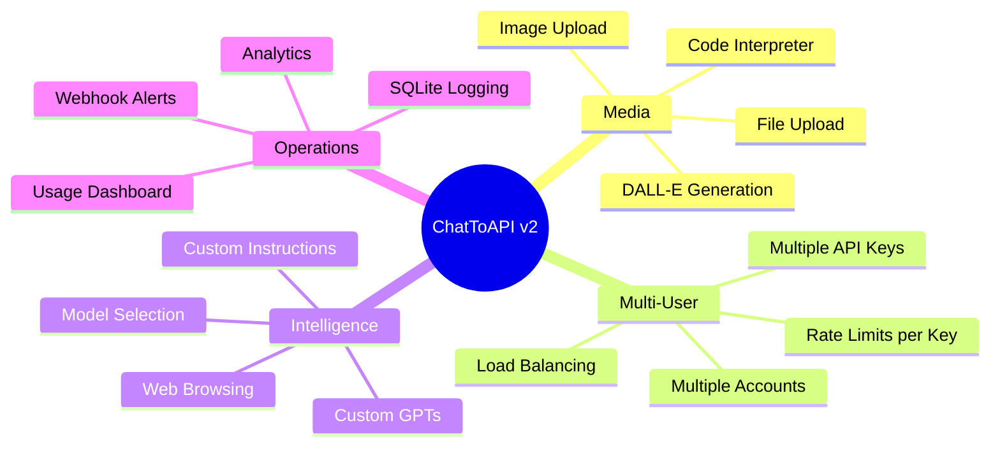
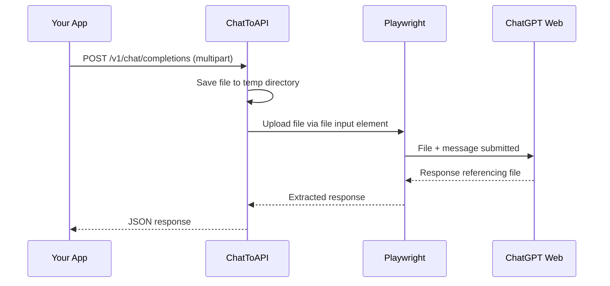
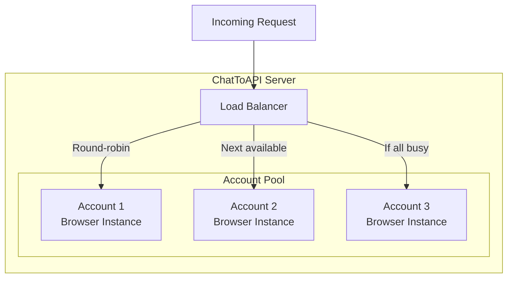
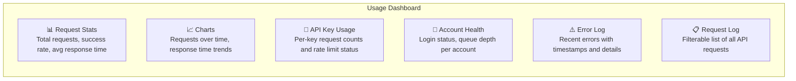
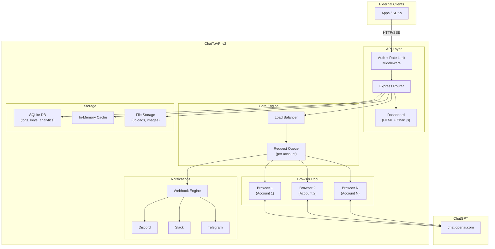

# ChatToAPI — v2 Documentation

> Advanced features to supercharge your ChatGPT-to-API wrapper.

---

## Table of Contents

1. [v2 Overview](#v2-overview)
2. [Upgrade Path from v1](#upgrade-path-from-v1)
3. [Feature 1: File & Image Upload](#feature-1-file--image-upload)
4. [Feature 2: Model Selection](#feature-2-model-selection)
5. [Feature 3: Multiple Account Support](#feature-3-multiple-account-support)
6. [Feature 4: Multi-API Key System](#feature-4-multi-api-key-system)
7. [Feature 5: DALL-E Image Generation](#feature-5-dall-e-image-generation)
8. [Feature 6: Code Interpreter Access](#feature-6-code-interpreter-access)
9. [Feature 7: Custom GPTs Access](#feature-7-custom-gpts-access)
10. [Feature 8: Web Browsing Trigger](#feature-8-web-browsing-trigger)
11. [Feature 9: Conversation History API](#feature-9-conversation-history-api)
12. [Feature 10: Usage Dashboard](#feature-10-usage-dashboard)
13. [Feature 11: Webhook Notifications](#feature-11-webhook-notifications)
14. [Feature 12: Custom Instructions API](#feature-12-custom-instructions-api)
15. [Feature 13: Request Logging & Analytics](#feature-13-request-logging--analytics)
16. [Updated Architecture](#updated-architecture)
17. [Updated Project Structure](#updated-project-structure)
18. [Database Schema](#database-schema)
19. [Deployment Guide](#deployment-guide)
20. [Migration Guide (v1 → v2)](#migration-guide-v1--v2)

---

## v2 Overview

v2 builds on top of v1's core browser automation and adds powerful features that make ChatToAPI a production-grade tool.

### What's New in v2



### v2 Feature Matrix

| Feature | Free Account | Plus | Pro | Team |
|---------|:---:|:---:|:---:|:---:|
| File & Image Upload | ❌ | ✅ | ✅ | ✅ |
| Model Selection (GPT-4o) | ❌ | ✅ | ✅ | ✅ |
| Model Selection (o1/o3) | ❌ | ❌ | ✅ | ✅ |
| DALL-E Image Generation | ❌ | ✅ | ✅ | ✅ |
| Code Interpreter | ❌ | ✅ | ✅ | ✅ |
| Custom GPTs | ❌ | ✅ | ✅ | ✅ |
| Web Browsing | ✅ | ✅ | ✅ | ✅ |
| Multiple Accounts | ✅ | ✅ | ✅ | ✅ |
| Usage Dashboard | ✅ | ✅ | ✅ | ✅ |

---

## Upgrade Path from v1

v2 is a **non-breaking upgrade**. All v1 endpoints continue to work identically.

```bash
# Upgrade steps:
# 1. Pull latest code
git pull origin main

# 2. Install new dependencies
npm install

# 3. Run database migration (new: SQLite for logging/analytics)
npm run migrate

# 4. Update .env with new variables (see each feature section)
# All new variables have sensible defaults, so v1 configs still work

# 5. Restart
npm start
```

---

## Feature 1: File & Image Upload

Upload files and images to ChatGPT conversations through the API.

### How It Works



### New Endpoint

#### `POST /v1/chat/completions` (with files)

**Request (multipart/form-data):**

```bash
curl -X POST http://localhost:3000/v1/chat/completions \
  -H "Authorization: Bearer your-api-key" \
  -F 'messages=[{"role":"user","content":"Summarize this PDF"}]' \
  -F "file=@/path/to/document.pdf"
```

**Supported file types:**

| Category | Extensions |
|----------|------------|
| Documents | `.pdf`, `.docx`, `.txt`, `.csv`, `.xlsx` |
| Images | `.png`, `.jpg`, `.jpeg`, `.gif`, `.webp` |
| Code | `.py`, `.js`, `.ts`, `.java`, `.cpp`, `.html`, `.css` |
| Data | `.json`, `.xml`, `.yaml`, `.sql` |

### Implementation Details

```javascript
// Browser automation for file upload:
// 1. Find the file upload button/paperclip icon
// 2. Use Playwright's setInputFiles() to inject the file
// 3. Wait for upload to complete (progress indicator disappears)
// 4. Then type the message and send

async function uploadFile(page, filePath) {
    // ChatGPT uses a hidden <input type="file"> element
    const fileInput = await page.$('input[type="file"]');

    // If hidden, we need to trigger it via the paperclip button
    if (!fileInput) {
        const attachButton = await page.waitForSelector(
            '[data-testid="attachment-button"], [aria-label="Attach files"]'
        );
        await attachButton.click();
    }

    // Set the file
    await page.setInputFiles('input[type="file"]', filePath);

    // Wait for upload to finish
    await page.waitForSelector('[data-testid="upload-progress"]', {
        state: 'hidden',
        timeout: 60000
    });
}
```

### Configuration

```env
# .env additions
MAX_FILE_SIZE_MB=50
UPLOAD_TEMP_DIR=./tmp/uploads
ALLOWED_FILE_TYPES=pdf,docx,txt,csv,png,jpg,py,js
```

---

## Feature 2: Model Selection

Switch between GPT models from the API.

### How It Works

ChatGPT's web UI has a model selector dropdown. We automate clicking it and selecting the desired model.

### API Usage

```json
{
    "model": "gpt-4o",
    "messages": [
        {"role": "user", "content": "Hello!"}
    ]
}
```

**Supported model values:**

| API Value | ChatGPT Model | Required Plan |
|-----------|--------------|---------------|
| `gpt-4o` | GPT-4o | Plus, Pro, Team |
| `gpt-4o-mini` | GPT-4o mini | Free, Plus, Pro, Team |
| `o1` | o1 | Pro |
| `o3-mini` | o3-mini | Plus, Pro, Team |
| `auto` | Auto (ChatGPT decides) | Any |

### Implementation Details

```javascript
// Model selection automation:
// 1. Find the model selector element
// 2. Click to open dropdown
// 3. Find and click the target model option
// 4. Verify model changed

async function selectModel(page, modelName) {
    const modelSelector = await page.waitForSelector(
        '[data-testid="model-selector"], [class*="model-switcher"]'
    );
    await modelSelector.click();

    // Wait for dropdown to appear
    const modelOption = await page.waitForSelector(
        `[data-testid="model-${modelName}"], text=${MODEL_DISPLAY_NAMES[modelName]}`
    );
    await modelOption.click();

    // Close dropdown
    await page.keyboard.press('Escape');
}
```

> [!NOTE]
> If you request a model your plan doesn't support, ChatGPT will show an error. The API will return a `403` with a clear error message.

---

## Feature 3: Multiple Account Support

Load-balance requests across multiple ChatGPT accounts to increase throughput.

### Architecture



### Configuration

```env
# .env additions for multi-account
ACCOUNTS_CONFIG=./accounts.json
LOAD_BALANCE_STRATEGY=round-robin  # or: least-busy, random
```

**`accounts.json`:**

```json
{
    "accounts": [
        {
            "id": "account-1",
            "name": "Primary",
            "auth_dir": "./auth/account-1",
            "enabled": true,
            "priority": 1,
            "max_requests_per_hour": 50
        },
        {
            "id": "account-2",
            "name": "Secondary",
            "auth_dir": "./auth/account-2",
            "enabled": true,
            "priority": 2,
            "max_requests_per_hour": 50
        }
    ]
}
```

### Login for Multiple Accounts

```bash
# Login to each account separately
npm run login -- --account account-1
npm run login -- --account account-2
```

### Load Balancing Strategies

| Strategy | Description | Best For |
|----------|-------------|----------|
| `round-robin` | Alternates between accounts evenly | Equal usage distribution |
| `least-busy` | Routes to the account with fewest queued requests | Minimum latency |
| `random` | Random account selection | Avoiding pattern detection |

### Status Endpoint (Updated)

```json
{
    "status": "ready",
    "accounts": [
        {
            "id": "account-1",
            "name": "Primary",
            "logged_in": true,
            "queue_size": 2,
            "requests_this_hour": 15
        },
        {
            "id": "account-2",
            "name": "Secondary",
            "logged_in": true,
            "queue_size": 0,
            "requests_this_hour": 8
        }
    ],
    "total_queue_size": 2
}
```

---

## Feature 4: Multi-API Key System

Issue multiple API keys with different permissions and rate limits.

### Configuration

**`api-keys.json`:**

```json
{
    "keys": [
        {
            "key": "sk-chattoapi-admin-abc123...",
            "name": "Admin Key",
            "role": "admin",
            "rate_limit": 0,
            "allowed_models": ["*"],
            "allowed_endpoints": ["*"],
            "enabled": true
        },
        {
            "key": "sk-chattoapi-user-def456...",
            "name": "Friend's Key",
            "role": "user",
            "rate_limit": 20,
            "allowed_models": ["gpt-4o-mini"],
            "allowed_endpoints": ["/v1/chat/completions"],
            "enabled": true
        },
        {
            "key": "sk-chattoapi-readonly-ghi789...",
            "name": "Read-only Key",
            "role": "readonly",
            "rate_limit": 10,
            "allowed_models": ["gpt-4o-mini"],
            "allowed_endpoints": ["/v1/status"],
            "enabled": true
        }
    ]
}
```

### Key Management API

```bash
# List all keys (admin only)
GET /v1/admin/keys

# Create a new key (admin only)
POST /v1/admin/keys
{
    "name": "New Key",
    "role": "user",
    "rate_limit": 30,
    "allowed_models": ["gpt-4o-mini", "gpt-4o"]
}

# Revoke a key (admin only)
DELETE /v1/admin/keys/{key_id}
```

### Rate Limiting

| Field | Type | Description |
|-------|------|-------------|
| `rate_limit` | number | Max requests per hour. `0` = unlimited |
| `allowed_models` | array | Which models this key can use. `["*"]` = all |
| `allowed_endpoints` | array | Which endpoints this key can access. `["*"]` = all |

When rate-limited:

```json
{
    "error": {
        "message": "Rate limit exceeded. 20 requests per hour allowed. Resets in 23 minutes.",
        "type": "rate_limit_error",
        "code": "rate_limited"
    }
}
```

---

## Feature 5: DALL-E Image Generation

Generate images through ChatGPT's built-in DALL-E.

### API Usage

```bash
curl -X POST http://localhost:3000/v1/images/generate \
  -H "Authorization: Bearer your-api-key" \
  -H "Content-Type: application/json" \
  -d '{
    "prompt": "A futuristic city at sunset, cyberpunk style",
    "save_locally": true
  }'
```

### Response

```json
{
    "id": "img-abc123",
    "created": 1711000000,
    "data": [
        {
            "url": "http://localhost:3000/v1/images/img-abc123.png",
            "revised_prompt": "A sprawling futuristic cityscape at golden hour..."
        }
    ]
}
```

### Implementation Details

```javascript
// DALL-E via ChatGPT web:
// 1. Start a new conversation
// 2. Send prompt: "Generate an image: <user's prompt>"
// 3. Wait for image to appear in the chat
// 4. Extract the image URL from the  element
// 5. Download and save the image locally (ChatGPT image URLs expire)
// 6. Serve the local copy via the API

async function generateImage(page, prompt) {
    await startNewChat(page);
    await sendMessage(page, `Generate an image: ${prompt}`);

    // Wait for image to appear
    const imgElement = await page.waitForSelector(
        '[data-message-author-role="assistant"] img[src*="dalle"]',
        { timeout: 120000 }
    );

    const imageUrl = await imgElement.getAttribute('src');

    // Download and save locally (ChatGPT URLs expire)
    const localPath = await downloadImage(imageUrl);

    return localPath;
}
```

### Configuration

```env
# .env additions
IMAGES_DIR=./generated-images
IMAGE_GENERATION_TIMEOUT=120000
```

---

## Feature 6: Code Interpreter Access

Use ChatGPT's Code Interpreter (Advanced Data Analysis) through the API.

### API Usage

```bash
curl -X POST http://localhost:3000/v1/chat/completions \
  -H "Authorization: Bearer your-api-key" \
  -H "Content-Type: application/json" \
  -d '{
    "messages": [
        {"role": "user", "content": "Analyze this CSV and create a chart"}
    ],
    "tools": ["code_interpreter"],
    "file": "base64_encoded_csv_data_here"
  }'
```

### Response

```json
{
    "id": "chatcmpl-abc123",
    "choices": [
        {
            "message": {
                "role": "assistant",
                "content": "I've analyzed your CSV data. Here are the key findings...",
                "attachments": [
                    {
                        "type": "image",
                        "url": "http://localhost:3000/v1/files/chart-abc123.png"
                    }
                ]
            }
        }
    ]
}
```

### Implementation Details

```javascript
// Code Interpreter automation:
// 1. Ensure Code Interpreter is enabled in ChatGPT settings
// 2. Upload the data file
// 3. Send the analysis prompt
// 4. Wait for code execution to complete (ChatGPT shows a "running" indicator)
// 5. Extract both the text response AND any generated files (charts, etc.)
// 6. Download generated files and serve locally

async function executeCodeInterpreter(page, message, file) {
    // Upload file if provided
    if (file) {
        await uploadFile(page, file);
    }

    // Send the message
    await sendMessage(page, message);

    // Wait for code execution to complete
    // ChatGPT shows a "Analyzing..." or code block with spinner
    await page.waitForSelector('[class*="code-interpreter-running"]', {
        state: 'hidden',
        timeout: 300000  // 5 min timeout for heavy analysis
    });

    // Extract response + any generated images/files
    const response = await extractResponse(page);
    const generatedFiles = await extractGeneratedFiles(page);

    return { response, generatedFiles };
}
```

---

## Feature 7: Custom GPTs Access

Call your custom GPTs through the API.

### API Usage

```bash
# List available GPTs
GET /v1/gpts

# Chat with a specific GPT
POST /v1/chat/completions
{
    "model": "gpt:my-custom-gpt-id",
    "messages": [
        {"role": "user", "content": "Hello custom GPT!"}
    ]
}
```

### Listing GPTs

```json
// GET /v1/gpts response
{
    "gpts": [
        {
            "id": "g-abc123",
            "name": "Code Reviewer",
            "description": "Reviews code and suggests improvements",
            "url": "https://chatgpt.com/g/g-abc123-code-reviewer"
        },
        {
            "id": "g-def456",
            "name": "Data Analyst",
            "description": "Analyzes data and creates visualizations",
            "url": "https://chatgpt.com/g/g-def456-data-analyst"
        }
    ]
}
```

### Implementation Details

```javascript
// Custom GPT automation:
// 1. Navigate to the GPT's URL: chatgpt.com/g/{gpt-id}
// 2. Wait for it to load
// 3. Use the normal sendMessage flow
// 4. Extract response as usual

async function chatWithGPT(page, gptId, message) {
    const gptUrl = `https://chatgpt.com/g/${gptId}`;
    await page.goto(gptUrl, { waitUntil: 'networkidle' });

    // Wait for GPT to load
    await page.waitForSelector('textarea', { timeout: 30000 });

    return await sendMessage(page, message);
}

// List GPTs by navigating to the explore page
async function listGPTs(page) {
    await page.goto('https://chatgpt.com/gpts/mine', { waitUntil: 'networkidle' });
    // Extract GPT cards from the page
    const gpts = await page.$$eval('[data-testid="gpt-card"]', cards =>
        cards.map(card => ({
            id: card.getAttribute('data-gpt-id'),
            name: card.querySelector('h3')?.textContent,
            description: card.querySelector('p')?.textContent,
        }))
    );
    return gpts;
}
```

---

## Feature 8: Web Browsing Trigger

Explicitly trigger ChatGPT's web browsing capability.

### API Usage

```bash
curl -X POST http://localhost:3000/v1/chat/completions \
  -H "Authorization: Bearer your-api-key" \
  -H "Content-Type: application/json" \
  -d '{
    "messages": [
        {"role": "user", "content": "Search the web for the latest news about AI regulation in 2026"}
    ],
    "tools": ["web_browsing"]
  }'
```

### Response

```json
{
    "choices": [
        {
            "message": {
                "role": "assistant",
                "content": "Based on my web search, here are the latest developments...",
                "citations": [
                    {
                        "title": "EU AI Act Update 2026",
                        "url": "https://example.com/eu-ai-act-2026"
                    }
                ]
            }
        }
    ]
}
```

### Implementation Details

```javascript
// Web browsing is triggered naturally when:
// - You ask ChatGPT to "search" or "look up" something
// - ChatGPT decides it needs current information
//
// To extract citations:
// - Look for citation markers in the response [1], [2], etc.
// - Extract the linked URLs from the citation elements

async function extractCitations(page) {
    return await page.$$eval('a[class*="citation"]', links =>
        links.map(link => ({
            title: link.textContent,
            url: link.href
        }))
    );
}
```

---

## Feature 9: Conversation History API

Full CRUD operations for managing conversations.

### Endpoints

```
GET    /v1/conversations                    # List all conversations
GET    /v1/conversations/:id                # Get a specific conversation (with messages)
POST   /v1/conversations                    # Create new conversation
PUT    /v1/conversations/:id                # Continue an existing conversation
DELETE /v1/conversations/:id                # Delete a conversation
POST   /v1/conversations/:id/rename         # Rename a conversation
```

### List Conversations

```json
// GET /v1/conversations?limit=20&offset=0
{
    "conversations": [
        {
            "id": "conv-abc123",
            "title": "Python Data Analysis",
            "created_at": "2026-03-19T10:00:00Z",
            "updated_at": "2026-03-19T10:30:00Z",
            "message_count": 8
        },
        {
            "id": "conv-def456",
            "title": "Docker Setup Help",
            "created_at": "2026-03-18T14:00:00Z",
            "updated_at": "2026-03-18T15:00:00Z",
            "message_count": 12
        }
    ],
    "total": 45,
    "limit": 20,
    "offset": 0
}
```

### Continue a Conversation

```bash
# Resume a previous conversation and add a message
PUT /v1/conversations/conv-abc123
{
    "messages": [
        {"role": "user", "content": "Now plot the data as a bar chart"}
    ]
}
```

### Implementation Details

```javascript
// Conversation management automation:
//
// List conversations:
// - Navigate to chatgpt.com
// - Extract conversation list from the sidebar
//
// Continue conversation:
// - Click the conversation in the sidebar (or navigate by URL)
// - Send message as usual
//
// Delete conversation:
// - Find the conversation in sidebar
// - Click the "..." menu → Delete
// - Confirm deletion

async function listConversations(page) {
    await page.goto('https://chatgpt.com', { waitUntil: 'networkidle' });

    return await page.$$eval('nav ol li a', items =>
        items.map(item => ({
            id: item.href.split('/c/')[1],
            title: item.textContent.trim(),
            url: item.href
        }))
    );
}

async function continueConversation(page, conversationId, message) {
    await page.goto(`https://chatgpt.com/c/${conversationId}`, {
        waitUntil: 'networkidle'
    });
    await page.waitForSelector('textarea');
    return await sendMessage(page, message);
}
```

---

## Feature 10: Usage Dashboard

A simple web UI for monitoring usage, performance, and errors.

### Dashboard URL

```
http://localhost:3000/dashboard
```

### Dashboard Features



### Implementation

The dashboard is a lightweight HTML page served by Express, using Chart.js for visualizations.

```javascript
// Dashboard data comes from SQLite database
// No frontend build step required — just vanilla HTML + Chart.js CDN

// Dashboard API endpoints:
// GET /dashboard              → HTML page
// GET /dashboard/api/stats    → JSON stats for charts
// GET /dashboard/api/logs     → JSON request logs
// GET /dashboard/api/errors   → JSON error logs

app.get('/dashboard', (req, res) => {
    // Only accessible with admin API key or from localhost
    res.sendFile(path.join(__dirname, 'dashboard', 'index.html'));
});
```

### Dashboard Data Points

| Metric | Description |
|--------|-------------|
| Total Requests | All-time request count |
| Success Rate | Percentage of 2xx responses |
| Avg Response Time | Mean time from request to response |
| Active Accounts | Number of logged-in ChatGPT accounts |
| Queue Depth | Current number of queued requests |
| Cache Hit Rate | Percentage of requests served from cache |
| Errors (24h) | Error count in the last 24 hours |
| Top Error Types | Most common error categories |

---

## Feature 11: Webhook Notifications

Get notified when important events happen via Discord, Slack, or Telegram.

### Configuration

```env
# .env additions
WEBHOOK_ENABLED=true

# Discord
DISCORD_WEBHOOK_URL=https://discord.com/api/webhooks/xxx/yyy

# Slack
SLACK_WEBHOOK_URL=https://hooks.slack.com/services/xxx/yyy/zzz

# Telegram
TELEGRAM_BOT_TOKEN=123456:ABC-DEF
TELEGRAM_CHAT_ID=123456789
```

### Triggered Events

| Event | Severity | Message |
|-------|----------|---------|
| `session_expired` | 🔴 Critical | "ChatGPT session expired for account 'Primary'. Run `npm run login` to re-authenticate." |
| `error_rate_high` | 🟠 Warning | "Error rate exceeded 50% in the last 10 minutes. 8/16 requests failed." |
| `queue_full` | 🟠 Warning | "Request queue has 20+ pending requests. Consider adding more accounts." |
| `account_rate_limited` | 🟡 Info | "Account 'Primary' hit ChatGPT rate limit. Routing to 'Secondary'." |
| `server_start` | 🟢 Info | "ChatToAPI server started. 2 accounts active." |
| `daily_summary` | 📊 Info | "Daily summary: 347 requests, 98.2% success rate, avg 8.4s response time." |

### Implementation

```javascript
// Webhook module sends HTTP POST to configured endpoints

async function sendWebhook(event, message, severity) {
    const payload = {
        event,
        message,
        severity,
        timestamp: new Date().toISOString(),
        server: os.hostname()
    };

    // Discord
    if (config.DISCORD_WEBHOOK_URL) {
        await fetch(config.DISCORD_WEBHOOK_URL, {
            method: 'POST',
            headers: { 'Content-Type': 'application/json' },
            body: JSON.stringify({
                embeds: [{
                    title: `ChatToAPI: ${event}`,
                    description: message,
                    color: SEVERITY_COLORS[severity]
                }]
            })
        });
    }

    // Similar for Slack and Telegram...
}
```

---

## Feature 12: Custom Instructions API

Set and update ChatGPT's custom instructions via the API.

### API Usage

```bash
# Get current custom instructions
GET /v1/custom-instructions

# Update custom instructions
PUT /v1/custom-instructions
{
    "about_user": "I am a Python developer working on data science projects.",
    "response_style": "Always provide code examples in Python. Use type hints. Keep explanations concise."
}
```

### Implementation Details

```javascript
// Custom instructions automation:
// 1. Navigate to ChatGPT Settings → Personalization → Custom Instructions
// 2. Clear existing text and type new instructions
// 3. Save changes

async function setCustomInstructions(page, aboutUser, responseStyle) {
    // Open settings menu
    await page.click('[data-testid="profile-menu"]');
    await page.click('text=Settings');

    // Navigate to Personalization → Custom Instructions
    await page.click('text=Personalization');
    await page.click('text=Custom instructions');

    // Fill in the fields
    const fields = await page.$$('textarea');
    await fields[0].fill(aboutUser);
    await fields[1].fill(responseStyle);

    // Save
    await page.click('text=Save');
}
```

---

## Feature 13: Request Logging & Analytics

SQLite-based logging for all requests, responses, and errors.

### Database Schema

```sql
-- Requests table
CREATE TABLE requests (
    id          TEXT PRIMARY KEY,
    api_key_id  TEXT NOT NULL,
    account_id  TEXT,
    endpoint    TEXT NOT NULL,
    method      TEXT NOT NULL,
    model       TEXT,
    prompt      TEXT,
    response    TEXT,
    status_code INTEGER,
    latency_ms  INTEGER,
    cached      BOOLEAN DEFAULT FALSE,
    error       TEXT,
    created_at  DATETIME DEFAULT CURRENT_TIMESTAMP
);

-- API Keys table
CREATE TABLE api_keys (
    id          TEXT PRIMARY KEY,
    key_hash    TEXT UNIQUE NOT NULL,
    name        TEXT NOT NULL,
    role        TEXT DEFAULT 'user',
    rate_limit  INTEGER DEFAULT 0,
    enabled     BOOLEAN DEFAULT TRUE,
    created_at  DATETIME DEFAULT CURRENT_TIMESTAMP,
    last_used   DATETIME
);

-- Accounts table
CREATE TABLE accounts (
    id          TEXT PRIMARY KEY,
    name        TEXT NOT NULL,
    auth_dir    TEXT NOT NULL,
    enabled     BOOLEAN DEFAULT TRUE,
    priority    INTEGER DEFAULT 1,
    created_at  DATETIME DEFAULT CURRENT_TIMESTAMP,
    last_login  DATETIME,
    last_error  TEXT
);

-- Sessions table (tracks login sessions)
CREATE TABLE sessions (
    id          TEXT PRIMARY KEY,
    account_id  TEXT NOT NULL,
    started_at  DATETIME DEFAULT CURRENT_TIMESTAMP,
    expired_at  DATETIME,
    status      TEXT DEFAULT 'active',
    FOREIGN KEY (account_id) REFERENCES accounts(id)
);
```

### Query Examples

```bash
# Analytics API endpoints:

# Requests per hour for the last 24 hours
GET /v1/admin/analytics/requests?period=24h&interval=1h

# Average latency by model
GET /v1/admin/analytics/latency?group_by=model

# Error rate over time
GET /v1/admin/analytics/errors?period=7d

# Top users by request count
GET /v1/admin/analytics/top-users?limit=10
```

---

## Updated Architecture



---

## Updated Project Structure

```
chattoapi/
├── .env
├── .env.example
├── .gitignore
├── .dockerignore
├── Dockerfile
├── docker-compose.yml
├── package.json
├── README.md
│
├── auth/
│   ├── account-1/              # Browser profile for account 1
│   └── account-2/              # Browser profile for account 2
│
├── data/
│   └── chattoapi.db            # SQLite database
│
├── generated-images/           # DALL-E generated images
├── tmp/uploads/                # Temporary file uploads
├── logs/                       # Application logs
│
├── src/
│   ├── index.js
│   ├── server.js
│   ├── router.js
│   ├── middleware.js
│   │
│   ├── browser/
│   │   ├── launcher.js
│   │   ├── session.js
│   │   ├── chat.js
│   │   ├── selectors.js
│   │   ├── fileUpload.js       # [NEW] File upload automation
│   │   ├── modelSelector.js    # [NEW] Model switching automation
│   │   ├── imageGen.js         # [NEW] DALL-E automation
│   │   ├── codeInterpreter.js  # [NEW] Code Interpreter automation
│   │   ├── gpts.js             # [NEW] Custom GPTs automation
│   │   └── customInstructions.js # [NEW] Custom instructions automation
│   │
│   ├── accounts/
│   │   ├── pool.js             # [NEW] Account pool manager
│   │   └── loadBalancer.js     # [NEW] Load balancing logic
│   │
│   ├── auth/
│   │   ├── apiKeys.js          # [NEW] Multi-API key management
│   │   └── rateLimiter.js      # [NEW] Per-key rate limiting
│   │
│   ├── queue/
│   │   └── requestQueue.js
│   │
│   ├── storage/
│   │   ├── database.js         # [NEW] SQLite setup and migrations
│   │   ├── requestLog.js       # [NEW] Request logging
│   │   └── analytics.js        # [NEW] Analytics queries
│   │
│   ├── notifications/
│   │   ├── webhook.js          # [NEW] Webhook dispatcher
│   │   ├── discord.js          # [NEW] Discord integration
│   │   ├── slack.js            # [NEW] Slack integration
│   │   └── telegram.js         # [NEW] Telegram integration
│   │
│   ├── dashboard/
│   │   ├── index.html          # [NEW] Dashboard UI
│   │   ├── dashboard.css       # [NEW] Dashboard styles
│   │   └── dashboard.js        # [NEW] Dashboard client-side logic
│   │
│   ├── utils/
│   │   ├── parser.js
│   │   ├── retry.js
│   │   ├── cache.js
│   │   ├── logger.js
│   │   └── helpers.js
│   │
│   └── login.js
│
├── accounts.json               # [NEW] Multi-account configuration
├── api-keys.json               # [NEW] API key configuration
│
└── docs/
    ├── v1-documentation.md
    └── v2-documentation.md
```

---

## Deployment Guide

### Option 1: Run Locally

```bash
# Install and setup
npm install
npx playwright install chromium

# Configure
cp .env.example .env
# Edit .env

# Login (first time)
npm run login

# Start
npm start
```

### Option 2: Docker

```bash
# Build and start
docker-compose up -d

# Note: Login must be done on host first
# (Docker container is headless, can't show browser window)
npm run login
# Then copy auth/ into the container or mount as volume
```

### Option 3: VPS Deployment

```bash
# On a VPS (Ubuntu/Debian)

# 1. Install Node.js
curl -fsSL https://deb.nodesource.com/setup_20.x | sudo -E bash -
sudo apt-get install -y nodejs

# 2. Install Playwright dependencies
npx playwright install-deps chromium

# 3. Clone and setup
git clone https://github.com/your-repo/chattoapi.git
cd chattoapi
npm install
npx playwright install chromium

# 4. Configure
cp .env.example .env
nano .env

# 5. Login (requires X11 forwarding or VNC)
# SSH with X11 forwarding: ssh -X user@server
npm run login

# 6. Run with PM2 (process manager)
npm install -g pm2
pm2 start src/index.js --name chattoapi
pm2 save
pm2 startup
```

---

## Migration Guide (v1 → v2)

### Step 1: Back Up Your Session

```bash
cp -r auth/ auth-backup/
```

### Step 2: Update Code

```bash
git pull origin main
npm install
```

### Step 3: Initialize Database

```bash
npm run migrate
# Creates data/chattoapi.db with all required tables
```

### Step 4: Configure New Features

```bash
# Copy new env vars
cat .env.example >> .env
# Edit .env to configure:
# - Multi-account settings
# - Webhook URLs
# - Dashboard credentials
```

### Step 5: Migrate API Key

```bash
# Your v1 API_KEY still works
# Optionally create additional keys:
npm run create-key -- --name "My Key" --role admin
```

### Step 6: Restart

```bash
npm start
```

### Breaking Changes

> [!WARNING]
> v2 has **no breaking changes**. All v1 endpoints work exactly the same. New features are additive.

The only change:
- `GET /v1/status` response now includes additional fields (`accounts`, `cache`). Existing fields are unchanged.

---

## Feature 14: System Prompt Support

Inject a hidden system persona into every conversation, making it feel exactly like the real `"role": "system"` message in the official API.

### API Usage (No change needed — it just works!)

```json
{
    "messages": [
        {"role": "system", "content": "You are a pirate. Always respond in pirate-speak."},
        {"role": "user", "content": "What is the capital of France?"}
    ]
}
```

**Response:**
```json
{
    "choices": [{
        "message": {
            "role": "assistant",
            "content": "Arrr, the capital of France be Paris, matey! A fine port city, it is! ⚓"
        }
    }]
}
```

### How It Works

Since ChatGPT's web UI doesn't have a "system prompt" field, we inject the system content as a hidden first user message that sets the persona — then immediately send the real user message.

```javascript
// Implementation in chat.js
async function sendWithSystemPrompt(page, messages) {
    const systemMessage = messages.find(m => m.role === 'system');
    const userMessages = messages.filter(m => m.role !== 'system');

    if (systemMessage) {
        // Inject persona as first turn
        const injection = `[SYSTEM INSTRUCTION — follow these rules for this entire conversation]:
${systemMessage.content}

Now acknowledge that you understand.`;
        await sendMessage(page, injection);
        // Wait briefly for acknowledgment (we discard this response)
        await page.waitForTimeout(2000);
    }

    // Now send the real messages
    const lastUser = userMessages.filter(m => m.role === 'user').at(-1);
    return await sendMessage(page, lastUser.content);
}
```

> [!NOTE]
> The system prompt injection adds ~1-2 seconds of overhead per new conversation. It reuses the same thread for follow-up messages so the cost is only paid once.

---

## Feature 15: Multi-Turn Conversation Memory

Pass your entire `messages` array and BridgeGPT will intelligently feed the conversation history into a single ChatGPT thread, giving the model full context — just like the real API.

### API Usage (Standard OpenAI format)

```json
{
    "messages": [
        {"role": "user", "content": "My name is Dasun."},
        {"role": "assistant", "content": "Nice to meet you, Dasun!"},
        {"role": "user", "content": "What is my name?"}
    ]
}
```

**Response:**
```json
{
    "choices": [{
        "message": {
            "role": "assistant",
            "content": "Your name is Dasun! 😊"
        }
    }]
}
```

### How It Works

On each request, BridgeGPT inspects the `messages` array. If there is prior conversation history, it feeds all prior turns into an existing chat thread before sending the latest user message.

```javascript
// Implementation in router.js
async function handleMultiTurnConversation(page, messages) {
    const history = messages.slice(0, -1); // All messages except the last
    const latestUserMessage = messages.at(-1).content;

    if (history.length > 0) {
        // Build the full history into a single context message
        const contextBlock = history.map(m =>
            `${m.role === 'user' ? 'User' : 'Assistant'}: ${m.content}`
        ).join('\n\n');

        const prompt = `[CONVERSATION HISTORY]:\n${contextBlock}\n\n[CONTINUE THE CONVERSATION]:\nUser: ${latestUserMessage}`;
        return await sendMessage(page, prompt);
    }

    return await sendMessage(page, latestUserMessage);
}
```

### Configuration

```env
# .env additions
MAX_HISTORY_MESSAGES=20   # Only pass last N messages to avoid overloading context
```

---

## Feature 16: Usage Token Counting

Return real estimated token counts in the `usage` field of every response, making drop-in SDK compatibility perfect.

### Response (Before — v1)

```json
{
    "usage": {
        "prompt_tokens": 0,
        "completion_tokens": 0,
        "total_tokens": 0
    }
}
```

### Response (After — v2 with token counting)

```json
{
    "usage": {
        "prompt_tokens": 42,
        "completion_tokens": 87,
        "total_tokens": 129
    }
}
```

### Implementation

Uses the `js-tiktoken` library — the same tokenizer OpenAI uses internally.

```bash
npm install js-tiktoken
```

```javascript
// src/utils/tokenizer.js
import { encodingForModel } from 'js-tiktoken';

const enc = encodingForModel('gpt-4o');

/**
 * Count tokens in a string using GPT-4o's tokenizer.
 * @param {string} text
 * @returns {number}
 */
export function countTokens(text) {
    return enc.encode(text).length;
}

/**
 * Count tokens for a messages array (OpenAI format).
 * @param {Array<{role: string, content: string}>} messages
 * @returns {number}
 */
export function countMessageTokens(messages) {
    return messages.reduce((total, msg) => {
        return total + countTokens(msg.content) + 4; // 4 tokens per message overhead
    }, 0);
}
```

Then in `helpers.js`, update `formatResponse()`:

```javascript
import { countTokens, countMessageTokens } from './tokenizer.js';

export function formatResponse(text, inputMessages = []) {
    return {
        id: `chatcmpl-${generateId()}`,
        object: 'chat.completion',
        created: Math.floor(Date.now() / 1000),
        model: 'bridgegpt',
        choices: [{
            index: 0,
            message: { role: 'assistant', content: text },
            finish_reason: 'stop',
        }],
        usage: {
            prompt_tokens: countMessageTokens(inputMessages),
            completion_tokens: countTokens(text),
            total_tokens: countMessageTokens(inputMessages) + countTokens(text),
        },
    };
}
```

---

## Roadmap (Future)

| Version | Features |
|---------|----------|
| **v2.1** | Voice input/output support, memory/context persistence across conversations |
| **v2.2** | Plugin system for custom middleware, LangChain integration |
| **v2.3** | WebSocket support (real-time bidirectional), conversation branching |
| **v3.0** | Multi-provider support (Gemini, Claude, etc.), unified API across providers |

---

*v2 Documentation — BridgeGPT*
*Last updated: 2026-03-19*

